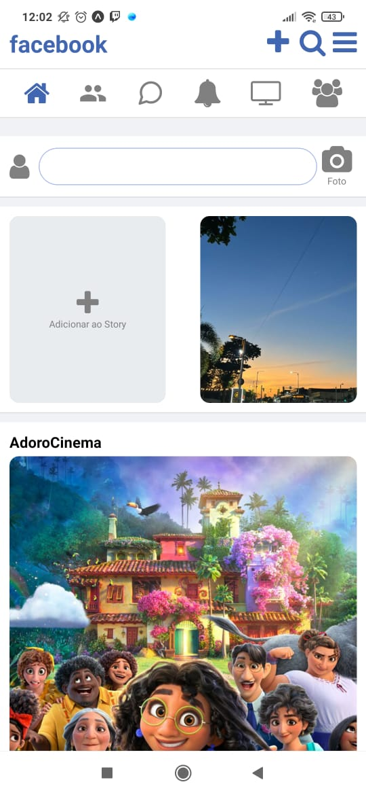

# Trabalho React Native

## Descrição

Este projeto é uma aplicação que contém várias telas, replicando algumas funcionalidades do Facebook Lite.

## Telas

### Tela HomeScreen

Esta é a tela de entrada do aplicativo.

### Tela de Login

Esta tela permite que os usuários façam login na aplicação. A verificação do e-mail é realizada no código, garantindo que o e-mail inserido contenha um "@".
### Tela original Facebook Lite

### Tela de Usuario

Após o login, os usuários são direcionados para a tela inicial, que tenta replicar a tela inicial do Facebook Lite.

### Tela de Perfil

Ao pressionar o ícone de perfil na tela inicial, os usuários são direcionados para uma tela sobre, que contém informações profissionais e links para o GitHub e LinkedIn.
